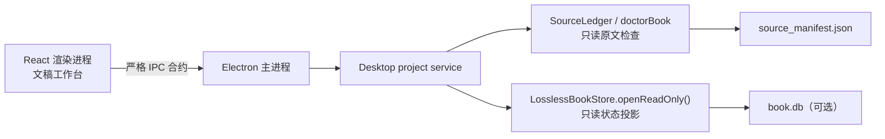

# FolioLoom Desktop Alpha 设计

## 目标

为 FolioLoom 建立一个本地运行的 Windows 桌面端预览：它以 Electron 包住现有 TypeScript 内核，并以一张安静、现代的“文稿工作台”作为主界面。用户能在不打开终端的情况下选择一个已经初始化的 V5 项目，读取真实原文与 SQLite 状态，执行无模型的 `doctor` 检查，并清楚理解后续试译、整书翻译、审阅和导出的顺序。

本阶段的产物是可在本机以开发模式启动的桌面应用和未来便携版所需的构建配置；不产生公开发布的 ZIP 或 exe。

## 已确认的界面方向

- 主布局采用“文稿工作台”，而不是高信息密度的“翻译驾驶舱”。
- 项目首页的主状态标题固定为简洁的“翻译中”；不使用“这本书正被织进中文”之类拟人化文案。
- 暗色阅读环境、低饱和青绿与蓝紫作为状态色，衬线体只用于书名和少量大标题；常规信息使用清晰的无衬线字体。
- 左侧保留项目、翻译运行、术语与记忆、审阅队列、导出五个稳定入口。Alpha 中未接通的入口必须显示明确说明，不能伪装成可用功能。
- 不使用“界面应该让人看见过程……”这句引语或类似宣言式装饰文案。

## 范围与非目标

### Alpha 包含

1. 一个 Electron + React 本地桌面应用，可用单条开发命令启动。
2. 项目选择页：使用系统文件选择器打开已有 `source_manifest.json`；用户可选填对应的 `book.db`。
3. 项目概览：从真实 manifest 与 SQLite 读取书名、源语言、原文字数、窗口数量、已完成/待处理/需人工查看窗口数，以及最近运行状态。
4. 无模型 `doctor`：调用现有 `doctorBook()`，展示原文覆盖、结构块、逻辑窗口、异常和导入术语表定位报告；此操作不读取 API Key，也不构造模型 provider。
5. 运行、术语、审阅、导出四个工作区的可浏览信息架构；只有当前已有真实数据的视图显示可操作内容。
6. Electron 构建元数据：Windows x64、便携目标所需的资源布局和产品图标占位；仅配置，不生成发布物。

### Alpha 不包含

- 从原始 TXT/EPUB/DOCX/Markdown 新建项目。现有 Python `main.py init` 将在下一阶段通过受控侧车接入。
- 直接发起模型翻译、管理 API Key、暂停/恢复活动模型任务或写入 V5 SQLite。不能为了看起来完整而绕过既有运行恢复协议。
- 在 GUI 中编辑知识库或手工改写 SQLite；术语表继续以已有 JSON 文件为单一事实来源。
- 自动更新、代码签名、真正的 `FolioLoom-portable-win-x64.zip` 发布物。

这组边界使第一版 GUI 成为真实的安全控制面，而不是带有伪进度条的静态演示或一个会破坏既有 SQLite 约束的第二翻译器。

## 架构

Electron 主进程是唯一能接触文件系统与 V5 核心的进程。渲染进程只能通过预加载脚本暴露的、固定形状的 IPC 调用取得可序列化的 `DesktopProjectSnapshot` 和 `DoctorReport`；它不能执行任意文件路径、Shell 命令、SQL 或网络请求。

新桌面服务从 `SourceLedger`、`doctorBook` 与 `LosslessBookStore.openReadOnly()` 建立只读投影，而不是解析 CLI 的终端文本。已有 CLI 仍是 V5 的命令行入口；桌面服务是同一内核的第二个适配器。

现有 `LosslessBookStore` 构造器会创建父目录并设置 WAL，不能被 GUI 当作只读读取器直接使用。核心因此新增显式的 `openReadOnly(path)` 工厂：以 Node `DatabaseSync` 的 `readOnly: true` 打开已存在数据库、跳过目录创建与 `journal_mode=WAL` 写入，随后复用现有 run、窗口与状态查询。任何写入方法仍会因 SQLite 只读连接失败；桌面服务只调用读取方法并始终关闭连接。

## 数据与交互

### 打开项目

用户点击“打开项目”，系统文件选择器限定到 `source_manifest.json`。选中后，主进程验证 manifest；若同目录或用户选择的位置存在有效 `book.db`，再读取唯一 run 或要求用户在 UI 中选择 run。不存在状态库时，项目仍可打开，状态显示为“尚未开始翻译”。

桌面端只持久化最近打开的 manifest 路径和可选 store 路径，保存到 Electron 用户数据目录；不会复制原文、译文或 API Key，也不会把项目数据写入应用安装目录。

### 项目概览

首页使用已确认的文稿工作台结构：左侧工作区导航；中央显示书名、语言、原文字数、当前 run 的进度与下一窗口；右侧显示窗口计数和按顺序的工作流。没有 run 时中央区域替换为清晰的“先执行原文检查”引导，绝不显示虚假的翻译百分比。

### 原文检查

“运行检查”调用 `doctorBook(manifestPath, windowOptions, glossaryPath?)`。结果用语义化状态卡片呈现：覆盖是否完整、块数、窗口数、可疑源文本项、术语表命中和未命中别形。失败时保留错误代码与下一步说明；不会退化为模糊的“出错了”。

### 未接通的工作区

翻译运行、术语与记忆、审阅队列、导出均共享正式信息架构和空状态，但只显示真实可读取的数据。对于 Alpha 尚不支持的写入动作，按钮不可用并明确写明“将在运行控制阶段接入”，不触发任何模型调用。

## 安全与一致性

- 预加载脚本开启 `contextIsolation`，关闭渲染进程 Node 集成；只暴露最小 API。
- 所有 IPC 请求使用判别式请求类型和路径后缀校验；主进程把错误转换为稳定、可显示的结构化结果。
- SQLite 只通过 `LosslessBookStore.openReadOnly()` 打开。任何缺失、歧义 run、源版本不匹配或数据库损坏都显示为不可继续状态，不能由 GUI 自动“修复”。
- 当前阶段不读取 `config.yaml` 中的 API Key，不从 OpenCode 认证文件加载密钥，也不向渲染进程暴露密钥。

## 便携版准备

桌面项目预先使用 Electron Builder 的 Windows x64 `portable` 目标配置产品名、应用标识、图标和 `extraResources` 边界。第一阶段只验证开发启动与 production build 输出目录；在 Python 导入侧车、端到端项目创建和模型运行接通前，不生成或发布任何可下载二进制。

未来发布时，`FolioLoom-portable-win-x64.zip` 将含有可双击的 `FolioLoom.exe` 和必要资源目录；原文、SQLite、译文和个人密钥仍始终在用户数据目录或用户选择的项目目录中。

## 测试与验收

自动测试覆盖：

- `LosslessBookStore.openReadOnly()` 不创建缺失路径、不设置 WAL 且保留既有状态查询；
- desktop snapshot 对无状态项目、单一 run、多个 run 和损坏 store 的可预测投影；
- IPC 路由只允许定义的请求，并拒绝越界、目录和错误后缀输入；
- `doctor` 适配器保持无模型调用，并保留现有 glossary 报告；
- 渲染层可在空项目和已打开项目状态下渲染关键状态文案，包括“翻译中”；
- production renderer 与 Electron 主进程可完成一次本地构建。

人工验收：开发模式启动后，用户能选中一个现有 manifest、看见真实项目概览、运行 doctor、切换工作区；窗口视觉保持已确认的文稿工作台方向，且不包含已删除的引语。

## Windows 融合标题栏补充（2026-07-22）

Windows 桌面窗口采用 Electron 原生标题栏叠加方案，而不是无边框窗口与自绘控制按钮。`BrowserWindow` 使用 `titleBarStyle: "hidden"` 和高度 42px 的暗色 `titleBarOverlay`，保留系统提供的最小化、最大化、关闭、窗口贴靠与无障碍行为；渲染层提供同高的深色拖拽区域，并在左侧低调显示“FolioLoom · 翻译中”。

默认 `File / Edit / View / Window` 应用菜单完全移除。实现不得为窗口按钮新增 IPC channel，不得使用 `frame: false`，也不得让拖拽区域覆盖右上角系统按钮或页面中的可交互控件。自动测试锁定窗口选项、菜单移除和渲染层标题栏；production build 后以 Windows 窗口烟雾检查确认白色原生栏与菜单不再出现。
