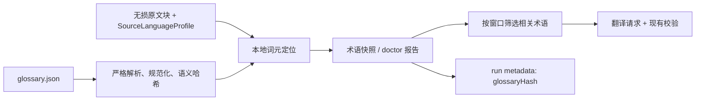

# 外部术语表导入设计

## 目标

让 FolioLoom 的 `book run` 能接收用户维护的 JSON 术语表，并在不调用模型的前提下，先以可复现的本地规则确认术语在原文中的实际出现位置。运行时只把与当前请求相关的术语送入翻译模型；恢复既有 run 时，必须使用语义相同的术语表。

这解决的是“用户明确知道的译名或称谓规则应从第一块开始生效”，而不是让术语表替代现有的叙事记忆、实体消歧或模型驱动的候选词发现。

## 非目标

- 本版本不支持 CSV、Excel、TMX、YAML 或在线术语库；输入格式固定为 JSON。
- 不用模型全文阅读、不会生成全书剧情提要，也不消耗模型 token 来扫描术语表。
- 不为所有常见词强制建立硬锁；称谓、敬语等依赖语境的项目可声明为 `contextual`。
- 不静默覆盖已有 V4 稳定术语或本次 run 已锁定的不同译名；冲突必须在模型调用前报错。

## 用户接口

`book doctor` 和 `book run` 新增可选参数：

```powershell
npm.cmd run folioloom -- book doctor `
  --manifest ..\projects\my_book\source_manifest.json `
  --glossary ..\projects\my_book\glossary.json

npm.cmd run folioloom -- book run `
  --manifest ..\projects\my_book\source_manifest.json `
  --store ..\projects\my_book\artifacts\folioloom\book.db `
  --config ..\config\config.yaml `
  --glossary ..\projects\my_book\glossary.json
```

最简 JSON 是源词到默认译名的映射，默认策略为 `preferred`：

```json
{
  "Severian": "塞万里安",
  "Typhon": "提丰"
}
```

需要别名、类别或语境规则时，使用显式结构：

```json
{
  "schema": "folioloom-glossary-1",
  "terms": [
    {
      "source": "Severian",
      "target": "塞万里安",
      "kind": "entity",
      "policy": "locked",
      "forms": ["Severian's"]
    },
    {
      "source": "Archon",
      "target": "执政官",
      "kind": "title",
      "policy": "contextual",
      "note": "制度或官职时译为“执政官”；直接呼告时可按中文语境译为“阁下”"
    }
  ]
}
```

每个字段的含义如下：

- `source`：原文中用于定位的规范形式。
- `forms`：可选的原文别形。每一个别形都会获得独立、可定位的稳定术语条目。
- `target`：建议或锁定的中文译法。
- `kind`：可选的自由分类标签，仅作为模型上下文和报告信息。
- `policy`：`locked`、`preferred` 或 `contextual`，省略时为 `preferred`。
- `note`：可选的简短语境说明。

`locked` 要求包含该原文形式的翻译在相应窗口中使用指定译法；`preferred` 是默认建议；`contextual` 只提供语义规则，不启用字面硬锁，适合官职与呼告等中文必须随句法改变的项目。

## 数据流



导入器使用当前源语言 profile 的 `segment()` 和 `normalizeSourceForm()` 进行词元序列匹配；它不使用朴素子串搜索，因此 `art` 不会命中 `party`。英语 profile 已有的所有格规范化也会让 `Typhon's` 与 `Typhon` 对齐。多词术语必须以连续的已规范化词元序列出现。

系统产出紧凑的 `folioloom-glossary-report-1` 报告：schema、语义哈希、源语言 profile、条目/别形数、每个条目的出现次数、首次 `globalIndex` 和未命中的别形。它不保存大段原文，因此可用于大型小说而不会使 SQLite 或 run metadata 膨胀。

## 内部模型与优先级

新增独立模块 `src/glossary/glossary-profile.ts`，负责：

1. 读取和验证 JSON；
2. 将规范词与别形展开为 `StableTerm`；
3. 用源语言 profile 对无损块做本地、确定性的定位；
4. 计算与文件路径、JSON 空白、对象键顺序和术语数组顺序无关的 SHA-256 语义哈希；
5. 给出指定窗口的相关稳定术语。

`StableTerm` 增加可选的 `policy`、`note` 和 `origin` 字段。导入术语的 `origin` 为 `glossary`。同一原文形式的合并优先级为：用户术语表 > 既有 V4 稳定术语 > 本 run 的知识快照。若前两者有不同目标译名，直接拒绝运行，不作静默选择。

术语进入已有 `translation-batch` 接口时：

- `locked` 映射为既有的 `locked: true`，复用已有完整性验证；
- `preferred` 和 `contextual` 保持 `locked: false`，同时把 policy 与 note 一并作为模型可读的稳定术语数据；
- 每次请求只注入当前窗口命中的词条，避免整本小说的词库污染上下文。

锚点候选发现收到用户术语表中已建立的源形式，因此不会把同一形式再次送交模型重新判定。

## 验证、容量与恢复

为避免把大段提示词伪装成术语表，导入器在模型调用前拒绝：非对象 JSON、未知字段、空字符串、重复的规范化形式、与旧术语的不同译名冲突，以及超过以下上限的文件：10,000 个逻辑条目、每条 16 个别形、原文或译文 240 个 Unicode 标量、注释 600 个 Unicode 标量。

每次 `book run --glossary` 都重新执行本地验证和定位。这是 CPU/IO 工作，不是模型扫描。对一个已有术语表配置的 run：

- 恢复时漏传 `--glossary`：在构造模型前明确失败；
- 内容语义改变：`glossaryHash` 不同，既有 store metadata 校验拒绝恢复；
- 仅调整 JSON 格式、键顺序、路径或术语数组顺序：语义哈希保持不变，可恢复。

`book doctor --glossary` 可以单独查看定位结果，不构造模型 provider。

## 测试与文档

自动测试覆盖：两种 JSON 形式、别形展开、跨语言 profile 规范化、多词词元匹配、不发生子串误命中、稳定哈希、输入限制、旧术语冲突、窗口级筛选、CLI 参数、doctor 报告、锁定术语复用既有 validator，以及恢复 metadata 一致性。

README 增加最简和结构化术语表示例、三种策略、doctor 用法、恢复限制和“无需模型预扫描”的说明；`config/glossary.example.json` 提供可复制样例。
