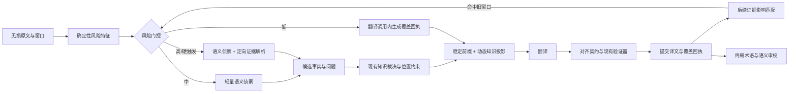

# FolioLoom 语义覆盖与终局审校设计

日期：2026-07-24  
目标版本：v1.2.0  
状态：待用户书面审阅

## 1. 背景

FolioLoom v1.1.1 已经具备无损原文账本、按位置开放的叙事记忆、术语与实体知识、动态并行窗口、结构化返回、完整性校验、失败恢复和桌面端操作流程。当前最重要的剩余风险不是“模型不会翻译句子”，而是：

1. 模型没有识别出一个决定后文含义的隐含事实，导致这条事实从未进入知识链路。
2. 不同窗口虽然各自可读，但段落对应、术语终态和跨段因果可能在全书完成后仍存在局部偏差。
3. 每次请求前部混入动态字段，浪费兼容服务商的前缀缓存。
4. 现有校验已经能检查块集合、段落数、长度、残留原文、跨块重复等问题，但缺少可持久化的“对齐契约”和独立终局审校记录。

本版本不尝试让系统“理解整本小说的一切”，也不把单一摘要当成真相。它新增一个统一的语义覆盖层：用透明风险评分决定哪些文本值得额外检查，用带证据的覆盖回执记录模型检查过什么，并在全书完成后只对实际有风险的位置做定向复核。

## 2. 设计目标

### 2.1 正确性

- 低风险文本不增加独立模型调用。
- 高风险文本不能只依赖同一次翻译调用的自我判断。
- 未确认的模型推断只能成为候选或 `unresolved`，不能直接升级成权威知识。
- 后文发现的新证据可以反向定位并重验受影响的旧译文。
- 最终术语审校只自动修改可确定的问题；语境词和叙事因果不得靠机械全局替换。
- 任意成功译文都必须满足来源块集合和段落对应契约。

### 2.2 性能

- 普通小说相对 v1.1.1 的端到端墙钟时间增幅不超过 15%。
- 高复杂度样本增幅不超过 30%。
- 不增加一次无条件的全书模型重读。
- 风险侦察可按波次提前、合批并与当前翻译并行。
- 最终审校先运行零模型成本的确定性检查，只把命中位置送给模型。

### 2.3 兼容性

- v1.1.1 的 schema v3 项目可以原地升级到 schema v4。
- 升级不得重扫原文、重建窗口或丢弃已有译文和知识。
- 已完成窗口初始标记为 `legacy_unassessed`，在终局审校或实际受影响时惰性补评。
- 未完成项目从原来的下一个待处理窗口继续。

## 3. 非目标

- 不建立一份宣称唯一正确的全书剧情大纲。
- 不要求模型解释文学隐喻、主题或作者意图。
- 不对所有段落调用第二个模型。
- 不允许摘要覆盖原文证据或已经确认的结构化知识。
- 不把动态术语表、叙事记忆或请求标识塞进稳定缓存前缀。
- 不以牺牲原文完整性换取速度。

## 4. 总体数据流

## 5. 稳定前缀缓存

### 5.1 请求分层

每次模型请求由三层组成：

1. **全局稳定协议**
   - 翻译职责与禁止事项；
   - 固定工具 schema；
   - 固定对齐要求；
   - 覆盖回执字段定义。
2. **书级稳定前缀**
   - 源语言与目标语言；
   - 用户确认的风格宪章；
   - 标点、段落和输出协议；
   - 不随窗口变化的项目设置。
3. **动态载荷**
   - `requestId`、`snapshotId` 和窗口标识；
   - 当前原文；
   - 按位置投影的术语、实体、关系与叙事记忆；
   - 局部风格锚点和前文尾部；
   - 风险结果、待回答问题和本轮预算。

动态载荷必须出现在明确的分隔符之后。请求标识不得再出现在提示词开头。

### 5.2 一致表示

新增 `StablePrefixManifest`：

- `protocolVersion`
- `prefixVersion`
- `sourceLanguage`
- `targetLanguage`
- `styleConstitutionHash`
- `toolSchemaHash`
- `canonicalPrefix`
- `prefixHash`
- `eligibleUtf8Bytes`

预算器和实际执行器必须消费同一个已准备请求对象，禁止各自重新拼接提示词。相同书级设置下，两个不同窗口的 `canonicalPrefix` 必须逐字节一致。

### 5.3 兼容行为

前缀缓存只是优化，不是正确性依赖。服务商不支持缓存、未返回缓存命中信息或修改了缓存策略时，结果仍应正确。运行记录只报告“可缓存字节”和服务商实际返回的命中数据，不虚构节省量。

## 6. 统一语义覆盖层

### 6.1 风险评估单位

风险评估以逻辑翻译窗口为主，并保留段落级特征位置。它不直接按任意字符分块判断，因为代词、因果和身份关系通常跨越相邻段落。

### 6.2 确定性风险特征

初始评分如下，后续只能通过版本化配置调整：

| 特征 | 分值 |
| --- | ---: |
| 未解析实体链接 | +4 |
| 同一代词存在多个候选先行词 | +3 |
| 多实体与高代词密度同时出现 | +2 |
| 身份、身体部件、所有权或控制关系 | +2 |
| 因果、条件、否定或反事实结构 | +2 |
| 叙述者、视角或时间层发生疑似切换 | +3 |
| 命中 `needs_revalidate` | +4 |
| 新出现或罕见但疑似重复的专名 | +1 |
| 关键句横跨块或窗口边界 | +2 |
| 命中当前位置可见的高影响记忆 | +2 |

分级：

- 0–2：低风险；
- 3–5：中风险；
- 6 及以上：高风险。

以下情况无视总分，直接硬触发高风险：

- 未解析身份会改变中文主语、称谓或性别表达；
- 两条活跃知识对同一实体身份发生冲突；
- 命中 `needs_revalidate`；
- 疑似叙述者、时间层或现实层切换；
- 因果方向决定动作对象或事件结果。

评分用于调度，不宣称概率校准。所有分项、命中位置和配置版本都必须持久化，便于解释误报与漏报。

### 6.3 便宜的语义侦察

- **低风险**：不额外调用模型；翻译结果同时返回最小覆盖回执。
- **中风险**：使用短提示、低输出预算的语义侦察，允许按相邻窗口合批，并提前一波运行。
- **高风险**：语义侦察后，把仍影响翻译的问题交给现有的定向证据解析器；必要时增加一次独立核验。

侦察只回答翻译所需的局部问题，例如“动作的承受者是谁”“两种称呼是否指同一实体”“谁控制这具身体的心跳”。它不得主动扩写主题分析和世界观百科。

### 6.4 语义覆盖回执

新增 `SemanticCoverageReceipt`，对下列维度分别记录 `found | absent | uncertain`：

- `identity`
- `coreference`
- `part_whole`
- `ownership_or_control`
- `causal_dependency`
- `timeline`
- `narrator_or_viewpoint`
- `knowledge_state`

每个非 `absent` 项还包含：

- 原文位置或证据 ID；
- 简短、原子化陈述；
- 是否影响当前翻译；
- 仍未解决的问题；
- 生成通道与模型；
- 覆盖协议版本。

覆盖回执本身不是知识真相。`found` 事实仍须进入现有候选、证据和裁决流程；`uncertain` 必须保留不确定性，不能被翻译模型当成已经确认的事实。

### 6.5 以“皮亚顿”为验收样例

测试夹具应故意让第一通道漏掉“皮亚顿原来的意识仍控制身体心跳”这一事实。风险特征至少因“双实体/同一身体、控制关系、因果方向”触发高风险。第二通道必须满足二者之一：

1. 找到有位置证据的控制关系，并生成可裁决候选；
2. 明确返回 `unresolved`，阻止系统假装已经理解。

不得以在代码中硬编码 `Piaton`、`Typhon`、`heart` 等词通过测试。

### 6.6 后验升级与反向重验

翻译后若出现以下信号，风险可以升级：

- 回执与译文陈述相互冲突；
- 新知识成为高影响活跃事实；
- 当前译文使原先隐藏的身份或因果歧义显性化；
- 新别名或实体合并改变旧窗口的主语解析；
- 知识进入 `needs_revalidate`。

影响匹配在现有 `knowledge_block_impacts` 基础上扩展：

- 源词形与别名；
- 实体链接；
- 一跳关系；
- 有位置约束的邻近块；
- 未解析代词所在的邻近段落。

只重验命中窗口，不全书回滚。

## 7. 严格段落对齐

### 7.1 对齐契约

现有验证器已经检查块集合、重复块、空译文、段落数、长度比例、跨块重复、布局标记和 Unicode。本版本在它之上新增不可变的 `AlignmentContract`，而不是另写一套冲突规则。

每个请求的契约包含：

- 有序 `blockId`；
- 每块原文哈希；
- 每块有序段落数与段落哈希；
- 场景分隔、续段和布局标记；
- 契约版本与总哈希。

模型仍按块返回译文。验证器必须检查：

- 块集合完全一致；
- 块顺序一致；
- 无重复或跨窗口块；
- 每块目标段落与源段落一一对应；
- 场景分隔和续段语义不被吞并；
- 相邻窗口没有无来源的重复段落。

### 7.2 修复策略

一次针对性修复只接收失败块、契约和具体错误。修复后重新运行完整验证。仍失败时：

- 不写入空译文；
- 不把部分成功伪装成完成；
- 保留候选和错误证据；
- 进入可恢复重试，超过预算后按既有策略转人工处理。

### 7.3 终局独立核验

全书完成后，从认证原文账本和当前活跃译文重新计算对齐，不能复用翻译阶段“已经通过”的布尔结果。这样可以发现后续导入、修复或版本切换造成的结构漂移。

## 8. 最终术语与叙事审校

### 8.1 冻结终态

全部窗口完成后，冻结：

- 最终知识快照 `K_final`；
- 最终术语快照；
- 活跃译文版本集合；
- 对齐契约版本。

冻结只为本次审校提供可复现输入，不阻止以后继续编辑知识。

### 8.2 两级审校

第一层为确定性扫描：

- `locked` 术语未采用锁定译法；
- 明确漏译、缺块、重复块或段落错位；
- 活跃译文引用了失效版本；
- 源哈希与对齐契约不匹配。

第二层只处理命中位置：

- `preferred/contextual` 术语在当前语境是否合理；
- 同一实体的别名、称呼或身份是否冲突；
- 新确认的因果事实是否使旧译文含义错误；
- `needs_revalidate` 是否仍影响活跃译文。

不把整本书和最终词库再次无差别发送给模型。

### 8.3 问题类型和自动修复边界

问题类型：

- `locked_term_violation`
- `contextual_term_conflict`
- `entity_identity_conflict`
- `narrative_causal_risk`
- `alignment_violation`

自动修复仅限：

- 有唯一目标的锁定术语；
- 可确定恢复的漏块、重复块和对齐错误。

语境术语、实体身份和叙事因果只能触发定向重验。任何修复都生成新译文版本，旧版本不可覆盖，并重新运行对齐、术语和语义覆盖校验。

## 9. SQLite schema v4

### 9.1 新表

在现有 schema v3 上增加：

- `stable_prefix_manifests`
  - 保存前缀版本、哈希、可缓存字节和书级设置哈希。
- `semantic_risk_assessments`
  - 保存窗口风险总分、分项、硬触发、等级和配置版本。
- `semantic_coverage_receipts`
  - 保存每次覆盖结果、通道、快照、状态和输入哈希。
- `semantic_coverage_findings`
  - 保存维度、证据、原子陈述、不确定性和知识候选链接。
- `alignment_contracts`
  - 保存请求/窗口的有序块与段落契约及哈希。
- `final_audit_runs`
  - 保存冻结快照、运行状态、进度和审校配置。
- `final_audit_issues`
  - 保存问题类型、位置、证据、处置状态和修复译文版本。

若现有事件表足以表示调度和重验事件，则不额外创建重复的队列表。

### 9.2 原地迁移

v3 → v4 在单个 `BEGIN IMMEDIATE` 事务内完成：

1. 核验 v3 表集合、marker 和 fingerprint；
2. 只创建新表和索引；
3. 为已有窗口写入惰性默认状态，不扫描原文；
4. 更新 marker、fingerprint 和 `PRAGMA user_version=4`；
5. 提交前运行故障注入检查点；
6. 失败则完整回滚。

迁移必须幂等可识别：重新打开已经成功升级的数据库只做 v4 校验，不重复写数据。只读打开 v3 数据库时不迁移，允许按旧能力读取；读写打开时自动升级。

## 10. 调度与性能控制

- 中风险侦察在下一波翻译开始前批量准备，和当前波模型调用重叠。
- 高风险证据解析沿用有上限的工具调用和证据集合。
- 每种风险等级有独立的模型调用、输入 token、输出 token和墙钟统计。
- 如果普通样本超出 15%：
  1. 先减少侦察误报；
  2. 再优化合批和预取；
  3. 不得通过跳过对齐或吞掉 `unresolved` 达标。
- 如果复杂样本超出 30%，同样优先优化调度，不直接放宽验收线。

## 11. 桌面端呈现

本版本只暴露用户真正需要的状态：

- 当前窗口风险：普通 / 需复核 / 高风险；
- 高风险原因的通俗说明；
- 未解决问题数；
- 终局审校进度和问题分类；
- 可选择自动继续或在高风险处暂停确认。

默认界面不展示数据库表名、哈希和内部协议。高级诊断页允许导出结构化报告，但不允许直接破坏底层账本。

## 12. 测试与验收

实现采用测试先行。

### 12.1 迁移

- 使用真实 schema v3 夹具升级；
- 升级前后源哈希、活跃译文、知识修订和待处理窗口完全一致；
- 已完成窗口不触发重扫；
- 事务故障可完整回滚；
- 二次打开不重复迁移。

### 12.2 稳定前缀

- 不同 `requestId`、`snapshotId` 和窗口原文下，稳定前缀逐字节相同；
- 修改风格宪章或协议版本后前缀哈希变化；
- 预算器统计的请求与实际发送请求完全相同；
- 无缓存服务商行为不变。

### 12.3 语义覆盖

- 皮亚顿微型夹具：第一通道漏检时，第二通道找到证据或明确 unresolved；
- 普通叙述样本保持低风险，不发生额外调用；
- 身份冲突、叙述者切换、因果方向和 `needs_revalidate` 均硬触发；
- 不可见的后文事实不能作为叙述者已知事实投影；
- 后来确认的事实只重验受影响窗口。

### 12.4 对齐

变异测试覆盖：

- 缺块；
- 多块；
- 重复块；
- 块顺序错误；
- 合并或拆分段落；
- 丢失场景分隔；
- 跨窗口污染；
- 相邻窗口重复尾段。

### 12.5 终局审校

- 锁定术语错误可确定性定位并安全修复；
- 语境术语只进入定向重验；
- 叙事因果风险不得机械替换；
- 修复产生新译文版本并保留历史；
- 未变化窗口和相同快照可跳过重复审校。

### 12.6 回归与性能

- 当前全部单元、集成、类型检查和桌面构建通过；
- 英语、日语、韩语样本均通过无损输入与对齐验证；
- 固定模拟模型基准用于 CI；
- 真实 DeepSeek smoke test 单独记录，不作为离线测试的随机依赖；
- 普通样本墙钟增幅 ≤15%，复杂样本 ≤30%。

## 13. 实施顺序

1. schema v4 和迁移夹具；
2. 请求准备对象与稳定前缀；
3. 对齐契约接入现有验证器；
4. 确定性风险提取与持久化；
5. 覆盖回执和中/高风险通道；
6. 后验升级与影响匹配；
7. 终局术语/叙事审校；
8. 桌面端状态和开关；
9. 全量回归、迁移演练、性能基准和发布文档。

## 14. 发布门槛

以下任一项未满足，不发布 v1.2.0：

- v1.1.1 项目不能无损原地升级；
- 普通窗口因新架构无条件多调用模型；
- 高风险事实漏检时系统仍把“未检查”记录为“已确认”；
- 对齐失败可进入完成状态；
- 最终审校对语境术语或叙事因果做机械全局替换；
- 性能超过约定上限且没有明确、可复现的外部服务原因；
- 当前正式工作流和桌面端回归测试不通过。
