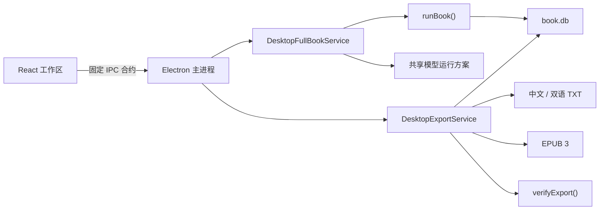

# FolioLoom 桌面端整本翻译与导出设计

日期：2026-07-25  
目标版本：v1.2.0  
状态：设计已口头确认，待书面复核

## 1. 背景

FolioLoom 当前桌面端已经可以导入 TXT、EPUB、DOCX 和 Markdown，配置并测试模型，执行单窗口试译，以及查看、导入和调整术语与知识。整本翻译、暂停恢复和成品导出仍然只能通过命令行完成；桌面端对应页面只是占位说明。

这会让不熟悉命令行的用户误以为 Release 中的程序只能试译，无法完成一本书。现有 V5 内核已经具备持久化运行、波次调度、故障恢复、严格文本导出和导出校验，本轮不重新实现翻译器，而是在 Electron 主进程中建立受控适配层，把这些能力接入桌面端，并补齐 EPUB 成品输出。

## 2. 目标

用户不打开终端即可完成以下闭环：

1. 导入并检查书稿；
2. 配置且测试模型；
3. 启动整本翻译；
4. 查看真实进度并安全暂停；
5. 关闭、重新打开软件后继续同一任务；
6. 翻译完成后导出中文 TXT、双语 TXT 和 EPUB；
7. 由系统自动校验导出文件，再向用户报告成功。

桌面端展示的进度、状态和可导出性必须来自 SQLite 持久化状态，不能由 React 页面自行推测。

## 3. 非目标

- 本轮不实现人工逐段审阅工作台；需要人工处理的窗口只显示明确状态和后续入口。
- 本轮不允许用户直接修改 SQLite。
- 本轮不提供多本书同时翻译；一个桌面进程同一时间只运行一个整本任务。
- 本轮不实现云端同步、自动更新或后台系统服务。
- 本轮不发布新 Release；完成代码和验收后再单独决定版本发布。
- 本轮不把未完成译文伪装成正式成品；默认 GUI 不提供“强制导出不完整任务”。

## 4. 总体架构

渲染进程只提交经过校验的意图，例如“启动当前项目”“请求暂停”“继续指定 run”“导出到用户选择的目录”。API Key、模型对象、文件系统、SQLite 和运行控制器始终留在主进程。

试译与整本翻译必须共享同一个模型运行方案构造模块，包括 provider、模型、思考强度、兼容能力、运行模式和指纹生成。不能复制一套近似逻辑，否则试译成功的配置可能在整本模式下变成另一种请求。

## 5. 整本翻译服务

### 5.1 运行状态

桌面服务向 GUI 投影以下状态：

- `idle`：没有整本任务；
- `preparing`：正在检查书稿、模型和状态库；
- `running`：正在翻译；
- `pausing`：已收到暂停请求，正在等待安全提交点；
- `paused`：任务可继续；
- `completed`：所有窗口完成且满足完成条件；
- `needs_attention`：存在需要人工处理或最终审校阻断；
- `failed`：本轮执行因可报告错误停止，已提交结果不丢失。

数据库仍是事实来源。状态机只是稳定的桌面投影，应用重启后必须根据 run、窗口状态和事件重新构造，不依赖内存中的旧状态。

### 5.2 新建任务

启动整本翻译前必须满足：

- 当前书稿已成功导入；
- 原文账本和窗口计划可用；
- 当前模型连接测试已通过；
- 没有另一个正在运行或正在暂停的整本任务；
- 项目目录和状态库可写。

单窗口试译与正式整本任务分离。点击“开始整本翻译”会创建带有 `workflowKind: "fullbook"` 的新 run，不会把试译 run 静默升级成正式任务。这样可以避免试译模式、测试提示词或旧模型配置污染成品。

### 5.3 模型配置锁定

run 元数据保存可复现的运行指纹，至少包含：

- provider；
- model id；
- 用户选择的思考强度；
- 快速或质量模式；
- 协议版本；
- 稳定提示词与风格配置指纹；
- 源版本。

继续任务时必须重新计算指纹。完全一致时继续原 run；不一致时明确告知用户“当前模型配置与该任务不一致”，允许恢复原配置或新建任务，但不得在同一个 run 中静默混用。

### 5.4 暂停和恢复

暂停是协作式安全暂停：

1. GUI 发出暂停请求；
2. 服务把状态切换为 `pausing` 并触发 `AbortSignal`；
3. 已经发出的原子请求可以完成校验并提交；
4. 后续波次不再启动；
5. 租约释放后状态变为 `paused`。

界面应说明“正在完成当前文本块后暂停”，不能承诺瞬间终止。应用被关闭或进程异常退出时，已经提交的窗口仍然保留；下次打开后由现有中断恢复机制回收未完成租约并继续。

### 5.5 进度

运行页显示：

- 当前书名、模型和运行模式；
- 已完成窗口 / 总窗口；
- 待处理、警告、需人工处理和失败窗口数；
- 持久化进度条；
- 当前状态及最近一次有意义的事件；
- 开始、暂停或继续按钮；
- “翻译时请保持程序运行”的普通提示。

主进程在每个持久化波次后发布节流后的进度事件；renderer 同时可以主动读取快照。事件只用于及时刷新，重新打开页面时仍以快照为准。

### 5.6 失败分类

- 身份验证、配额和模型能力问题：停止新请求，保留进度，显示模型配置入口；
- 临时网络错误：由既有重试策略处理，耗尽后保留为可继续状态；
- SQLite 锁、磁盘空间或写入错误：安全停止，不覆盖已有提交；
- 模型配置指纹不一致：拒绝继续，不自动换模型；
- `human_required` 或最终审校阻断：进入 `needs_attention`，不标记完成；
- 用户暂停：不得显示成失败。

切换书稿或退出当前项目时，如果任务仍在运行，必须先请求暂停并等待安全边界，不能把活动控制器遗留在旧项目。

## 6. 导出服务

### 6.1 可导出条件

默认只允许导出满足以下条件的正式整本 run：

- 所有要求窗口均已提交；
- 没有阻断性审计事件；
- 来源版本与当前书稿一致；
- 当前活动译文覆盖完整；
- 最终校验允许发布。

存在多个 run 时，导出页显示可读的 run 列表，包括模型、模式、时间、完成度和状态；用户必须明确选择。试译 run 不进入正式导出候选。

### 6.2 输出内容

用户选择目标目录和格式。默认勾选：

1. 中文译文 TXT；
2. 原文与译文对照 TXT；
3. 中文 EPUB。

审计、指标和 lineage 文件随导出自动生成，不作为普通用户必须理解的格式开关。GUI 文件名使用经过 Windows 安全化处理的书名；CLI 现有默认文件名和行为保持兼容。

默认目录为项目下的 `exports/<run-id>/`；用户可以通过系统目录选择器更换。写入过程先使用临时文件或临时目录，全部成功并校验后再原子替换最终文件，避免残缺文件看起来像成功成品。

### 6.3 EPUB 3

EPUB 使用数据库中的有序原文块和活动译文重建阅读顺序：

- 能可靠识别章节边界时，每章生成一个 XHTML 文档；
- 章节元数据不足时，按原始顺序生成稳定的分节；
- 保留段落边界、场景分隔和必要的空行语义；
- 对标题、正文和元数据执行 XML 转义；
- 文件名使用稳定、安全且不依赖原始标题字符的编号；
- 包含 `mimetype`、`META-INF/container.xml`、`package.opf`、`nav.xhtml`、正文 XHTML、基础 CSS；
- 在 EPUB 内嵌 lineage 元数据，供现有校验器验证来源和 run。

首版 EPUB 只包含中文译文；双语成品由对照 TXT 提供。

### 6.4 导出校验

导出完成后必须调用现有严格校验并补充 EPUB 结构检查：

- 原文块集合和顺序；
- 活动译文覆盖率；
- 段落与章节顺序；
- TXT 和审计 lineage；
- EPUB ZIP 结构、`mimetype`、OPF、导航、XHTML 可解析性；
- EPUB 内嵌 lineage 与当前 run 一致。

只有所有已选格式通过校验后，GUI 才显示“导出完成”。失败时保留诊断信息，清理临时产物，不把半成品列入成功文件。

## 7. IPC 与安全边界

新增最小 IPC 合约：

- 获取整本运行快照；
- 启动整本翻译；
- 请求暂停；
- 继续指定 run；
- 订阅可信进度事件；
- 获取可导出 run；
- 选择导出目录；
- 执行导出；
- 打开最近一次成功导出的文件夹。

所有请求使用判别联合类型和路径后缀校验。renderer 不传任意 SQL、Shell 命令、模型密钥或任意可执行路径。打开文件夹只允许打开主进程刚刚确认过的成功导出目录。

## 8. GUI

### 8.1 翻译运行

以现有桌面端视觉系统替换占位页面，不重新设计全套外观。空状态引导用户先导入书稿并测试模型；准备完成后显示运行模式和“开始整本翻译”。运行中突出进度、状态和唯一有效操作“暂停”；暂停后显示“继续翻译”。

按钮必须由真实状态决定是否可用，不以延时动画假装完成。所有错误在页面内给出下一步，而不是让输入框消失或恢复初始状态。

### 8.2 导出

导出页包含：

- 正式 run 选择；
- 完成度和可导出性；
- 输出目录；
- 三种成品格式；
- “导出文件”按钮；
- 校验阶段；
- 成功文件列表和“打开文件夹”。

不可导出时显示具体阻断原因，例如“仍有 12 个文本块未完成”，而不是只禁用按钮。

## 9. 兼容与迁移

- 不修改现有书稿清单格式；
- 不破坏现有 SQLite run、试译、知识工作台或 CLI；
- 现有 CLI `book run`、`book export` 和 `book verify-export` 行为保持兼容；
- 已经部分完成的正式 run 在新 GUI 中可以恢复；
- 老数据库缺少 `workflowKind` 时按兼容规则识别：有完整正式运行元数据的 run 可作为恢复候选，否则只读展示，不自动当成正式任务；
- Windows 便携版继续把项目、数据库、导出文件和密钥放在用户数据或用户选择的位置，不写入安装目录。

## 10. 测试

实现采用测试先行。

### 10.1 服务与状态

- 新建正式 run 与试译 run 隔离；
- 同一桌面进程拒绝两个活动整本任务；
- 每个持久化波次正确刷新进度；
- 暂停等待安全边界并释放租约；
- 继续使用同一 run，不重复已提交窗口；
- 应用重启后可从数据库重建 `paused` / `completed` / `needs_attention`；
- 模型指纹变化时拒绝静默继续；
- 网络、配额、磁盘和人工处理状态映射正确。

### 10.2 IPC 与 renderer

- IPC 拒绝畸形 run id、路径和非法状态转换；
- 只有可信 sender 能收到进度事件；
- 运行页在空项目、未测试模型、运行、暂停、失败和完成状态下按钮正确；
- 导出页正确解释不可导出原因；
- 页面刷新和路由切换不丢失正在运行的主进程任务；
- 切换书稿时不会遗留活动任务。

### 10.3 导出与 EPUB

- 中文 TXT、双语 TXT 保持原文顺序和完整覆盖；
- EPUB 中 `mimetype` 位于首项且不压缩；
- OPF、导航和正文 XHTML 可解析；
- XML 特殊字符、中文、日文、韩文和 Windows 文件名安全；
- 有章节和无章节两类书稿均可生成；
- lineage 与 run、源版本一致；
- 中途写入失败不留下伪成功文件；
- `verifyExport()` 对篡改、缺章、错序和错误 lineage 均失败。

### 10.4 端到端验收

使用确定性假模型完整运行：

1. 导入测试书稿；
2. 配置并测试模型；
3. 启动整本翻译；
4. 完成若干窗口后暂停；
5. 重启桌面服务并继续；
6. 完成全部窗口；
7. 导出三种成品；
8. 验证 TXT、EPUB、审计与 lineage；
9. 构建 Electron production 包；
10. 从 `win-unpacked` 启动并执行一次 GUI 烟雾测试。

正式完成声明前运行现有全量回归、desktop renderer 测试、类型检查、production build 和 Windows 便携目录构建。

## 11. 验收标准

- 普通用户全程不使用命令行即可翻译并导出一本书；
- 暂停、关闭软件和异常中断均不会丢失已提交译文；
- 继续任务不会静默混入另一模型配置；
- GUI 展示的窗口计数与 SQLite 一致；
- 中文 TXT、双语 TXT、EPUB 均能由 GUI 生成并通过自动校验；
- 未完成或审计阻断的任务不能被标为正式导出成功；
- 原有试译、知识工作台、模型设置和 CLI 测试不回归；
- production Electron 构建和 `win-unpacked` 烟雾测试通过。
